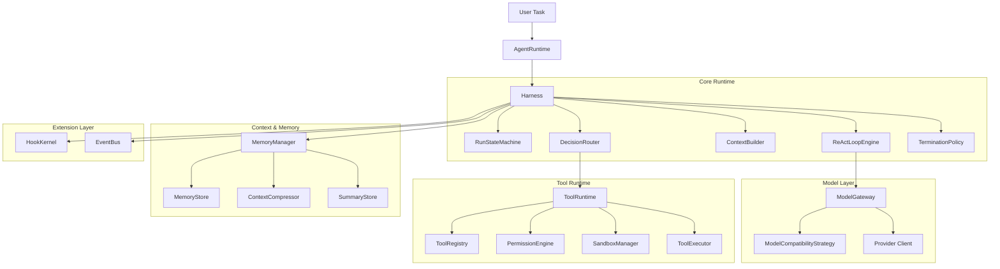

# 01. 当前现状与目标架构

本文件回答三个问题：

1. 当前仓库已有的基础是什么
2. 当前缺的核心能力是什么
3. 目标中的 agent runtime 应该分成哪些模块

## 1. 当前现状

### 1.1 已有能力

当前仓库的 `packages/provider` 已经具备：

- 模型统一调用接口
- tool calling 的 canonical type
- streaming
- hooks
- retry / timeout
- provider adapter

这意味着未来 agent runtime 不需要重做以下内容：

- OpenAI / Anthropic / MiniMax 的请求体映射
- tool_call / tool_result 的基础协议封装
- 统一错误类型的第一层抽象

### 1.2 尚未形成的能力

当前仓库还没有形成真正意义上的 `agent core runtime`，缺少：

- 显式的 `AgentRuntime`
- 显式的 `Harness`
- 显式的 `RunStateMachine`
- 标准化的 `AgentDecision`
- 完整的 `ToolRuntime`
- 完整的 `PermissionEngine`
- 完整的 `SandboxManager`
- `ContextBuilder`
- `ContextCompressor`
- `MemoryManager`
- `TerminationPolicy`
- `HookKernel`

也就是说，当前还只是“可以调模型”，不是“可以稳定执行一个复杂 agent 任务”。

## 2. 目标问题定义

### 2.1 这个 agent runtime 要解决什么问题

它要解决的不是“怎么向 LLM 发一个请求”，而是下面这些更复杂的问题：

1. 如何把一个用户任务拆成多轮执行
2. 如何在每轮中使用工具，并把结果回填给下一轮
3. 如何控制权限，避免危险工具未经批准就执行
4. 如何在 sandbox 中执行工具，防止工具越权
5. 如何在上下文过长时保持模型还能继续稳定执行
6. 如何在任务过程中记住有价值的信息
7. 如何判断“现在已经完成了”或“现在其实是在空转”
8. 如何让外部通过 hook / plugin 扩展能力，而不破坏核心执行流

### 2.2 目标不是做什么

下面这些不是本架构的核心目标：

- 追求所有模型都通过一套 prompt 完美运行
- 一开始就做复杂多 agent 协作
- 一开始就做向量数据库和复杂检索
- 一开始就支持所有 sandbox provider

这些都可以后续扩展，但第一版必须先把核心控制流建立起来。

## 3. 目标模块图



## 4. 各模块存在的必要性

这一节不是列功能，而是说明“为什么一定要拆出来”。

### 4.1 AgentRuntime

如果没有这一层，那么：

- run 的创建、恢复、暂停、取消会散落在各处
- 外部调用者不知道如何观察一个任务状态
- checkpoint 与恢复点没有统一入口

因此 `AgentRuntime` 必须作为最外层运行控制器存在。

### 4.2 Harness

如果没有 Harness，主循环会退化成：

- 一段 while-loop
- 一堆 if/else
- 各种跨层依赖直接串起来

当你引入权限等待、用户确认、memory、summary、暂停恢复后，这种结构会立即失控。

Harness 的存在价值是：

- 让主执行流有唯一总控
- 让每一轮 step 的前后时机明确
- 让 hook / tool / memory / termination 都接入一个确定节点

### 4.3 ReActLoopEngine

如果把 ReAct 全部塞在 Harness 里，会导致 Harness 职责膨胀。

ReActLoopEngine 应该专注于：

- 这一轮怎么和模型交互
- 这一轮返回了什么决策

这样 Harness 只需要编排，不需要自己承担所有模型交互细节。

### 4.4 ToolRuntime

工具调用如果不单独做一层，很容易出现：

- 权限逻辑写在工具里
- sandbox 逻辑写在工具里
- 参数校验写在多处
- observation 标准化没有统一位置

所以 `ToolRuntime` 必须是“工具事务层”，统一处理一切工具执行相关流程。

### 4.5 MemoryManager

如果上下文压缩和记忆写入都分散在 loop 中，后面你很难回答：

- 什么时候该 summary
- 什么时候写入长期记忆
- 什么时候该取哪些记忆进上下文

MemoryManager 的价值是把“上下文治理”独立出来。

### 4.6 TerminationPolicy

结束判定不能写死在 prompt 和 loop 里，否则：

- 不同 agent 场景无法定制
- 模型一旦“误以为完成”，runtime 会直接结束
- 空转检测没有明确归属

所以 termination 必须是独立策略对象。

## 5. 目标中的目录建议

这一节先给目标目录，不代表现在立刻实现全部代码，而是后续实现时不要随意堆文件。

```text
packages/agent/src/
  runtime/
    agent-runtime.ts
    harness.ts
    react-loop.ts
    run-state-machine.ts
    decision-router.ts
  model/
    model-gateway.ts
    model-compatibility-strategy.ts
  tools/
    tool-runtime.ts
    tool-registry.ts
    tool-executor.ts
  permissions/
    permission-engine.ts
    permission-policy.ts
  sandbox/
    sandbox-manager.ts
    sandbox-profile.ts
  memory/
    memory-manager.ts
    memory-store.ts
    memory-write-policy.ts
    memory-retrieval-policy.ts
    context-builder.ts
    context-compressor.ts
    summary-store.ts
  termination/
    termination-policy.ts
  hooks/
    hook-kernel.ts
    hook-types.ts
  events/
    event-bus.ts
    trace-types.ts
  types/
    run.ts
    step.ts
    decision.ts
    tool.ts
    memory.ts
```

这个目录的意义在于让你从第一天开始就按领域拆分，而不是以后从一个超大文件里往外拆。

## 6. 核心领域对象

为了避免实现时“各层传一堆 loose object”，建议先统一核心对象。

### 6.1 AgentRun

表示一次完整任务运行实例。

必须包含：

- `runId`
- `agentId`
- `status`
- `userGoal`
- `createdAt`
- `updatedAt`
- `stepIndex`
- `budget`
- `pendingApproval`
- `pendingUserInput`
- `finalResult`
- `error`

它的作用是：

- 作为 checkpoint 恢复入口
- 作为 trace 关联主键
- 作为 memory 写入和工具执行的归属标识

### 6.2 StepState

表示某一轮 step 的内部状态。

建议至少包含：

- `stepIndex`
- `workingContext`
- `modelRequest`
- `modelResponse`
- `decision`
- `toolInvocations`
- `toolResults`
- `observation`
- `memoryCandidates`
- `terminationDecision`

它的作用是：

- 让单轮执行可调试
- 让 step 级 checkpoint 成为可能
- 让日志和审计更清晰

### 6.3 AgentDecision

表示模型本轮的统一决策结果。

不能直接把 provider response 往下传，必须统一成：

- `type`
- `reasoningSummary`
- `finalAnswer`
- `toolCalls`
- `askUserMessage`
- `blockedReason`
- `metadata`

### 6.4 ToolInvocation / ToolExecutionResult

一次工具调用和工具结果都必须是结构化对象，而不是“随手拼一段字符串”。

原因是后续你要做：

- 权限检查
- 审计
- 重试
- observation 压缩
- memory 提取

这些都依赖结构化结果。

## 7. 顶层实现原则

### 7.1 主流程一定要显式

实现时，必须能在一个入口里看到完整控制流：

1. build context
2. call model
3. parse decision
4. execute tool or finalize
5. update observation
6. update memory
7. check termination

如果你发现主流程被分散到多个 hook 文件里，就说明架构已经走偏。

### 7.2 兼容逻辑不要污染主循环

某些模型的特殊行为兼容，必须放到 `ModelCompatibilityStrategy` 或兼容 middleware。

不要写成：

- `if model === x`
- `if vendor === y`

出现在 Harness 主路径里。

### 7.3 事务边界要清楚

下面这些事务边界必须稳定：

- 一次 run
- 一次 step
- 一次 tool invocation
- 一次 approval
- 一次 memory persist

## 8. 本文件结论

本文件的核心结论只有三条：

1. 当前仓库已经有 `provider`，但还没有真正的 `agent runtime core`。
2. 目标架构必须围绕 `Harness` 构建，而不是围绕散乱 hook 构建。
3. 后续实现时必须把 `runtime / tool / memory / policy / hook` 明确拆层，否则架构很快会失控。

