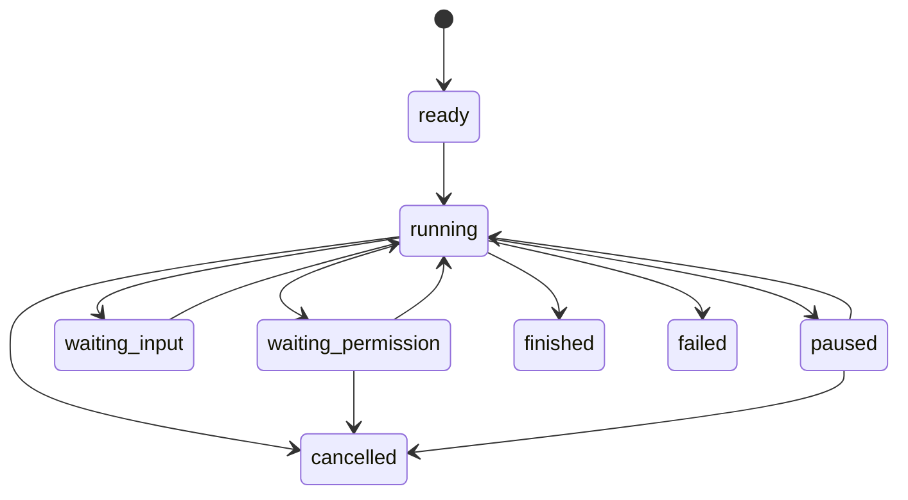

# 02. Runtime、Harness 与 ReAct 主循环

本文件是整个设计集里最重要的一份，因为它定义了 agent runtime 的主执行流。

如果这一层没设计清楚，后面的 tool、memory、hook、termination 都会失去落点。

## 1. 这一层解决的问题

这一层专门解决：

- 一个任务如何开始
- 一轮 step 如何推进
- 一轮结束后如何决定下一轮
- run 如何暂停、等待批准、恢复、结束

这一层不解决：

- 模型协议细节
- 工具底层执行细节
- memory 底层存储细节

## 2. 模块分工

这一层建议拆成 5 个核心模块：

- `AgentRuntime`
- `Harness`
- `RunStateMachine`
- `ReActLoopEngine`
- `DecisionRouter`

## 3. AgentRuntime 需要实现什么

AgentRuntime 是最外层对外入口。它不是思考引擎，而是运行控制器。

### 3.1 主要职责

必须实现：

- 创建 run
- 启动 run
- 查询 run 状态
- 暂停 run
- 恢复 run
- 取消 run
- 拉取 run trace
- 返回最终结果

### 3.2 不应该承担的职责

不应该在这一层做：

- 构建 prompt
- 解析 tool call
- 执行 tool
- 压缩上下文
- 写 memory

这些都应该交给 Harness 或下层模块。

### 3.3 典型调用流

```text
submit task
-> create run
-> hand off to Harness
-> persist run state
-> stream events / wait result
-> return final state
```

### 3.4 建议的公开方法

下面不是代码，而是实现者必须提供的能力清单：

- `createRun(input)`
  - 负责生成 `runId`
  - 初始化 run 状态
  - 记录用户目标和 budget

- `startRun(runId)`
  - 让一个 `ready` 的 run 进入 `running`
  - 调用 Harness 执行

- `resumeRun(runId, resumeInput?)`
  - 从 `paused`、`waiting_permission`、`waiting_input` 状态恢复

- `pauseRun(runId)`
  - 将正在执行的 run 标记为 `paused`

- `cancelRun(runId)`
  - 终止当前 run

- `getRun(runId)`
  - 返回结构化 run 信息

- `getRunTrace(runId)`
  - 返回 step、tool、memory、termination 相关事件

## 4. Harness 需要实现什么

Harness 是整个 runtime 的中枢。它的职责不是“单一功能”，而是“统一编排”。

### 4.1 Harness 的核心职责

Harness 必须负责：

1. 读取和推进 run state
2. 驱动单轮 step 执行
3. 调用 ContextBuilder 构造上下文
4. 调用 ReActLoopEngine 与模型交互
5. 根据决策分发到 final / tool / ask_user / blocked 分支
6. 处理 tool observation 回填
7. 调度 memory 更新和上下文压缩
8. 调用 termination policy 判断是否结束
9. 在每个关键节点触发 hook 和 event

### 4.2 Harness 不应该做什么

Harness 不应该：

- 直接写 provider adapter 兼容代码
- 直接实现某个 sandbox provider
- 直接读写 memory 的数据库细节
- 用大量 `if model == ...` 判断模型差异

### 4.3 Harness 的内部时序

```mermaid
sequenceDiagram
    participant Runtime as AgentRuntime
    participant Harness
    participant Context as ContextBuilder
    participant Loop as ReActLoopEngine
    participant Tools as ToolRuntime
    participant Memory as MemoryManager
    participant Term as TerminationPolicy

    Runtime->>Harness: runUntilStop(run)
    loop Each step
      Harness->>Context: buildStepContext(run)
      Context-->>Harness: workingContext
      Harness->>Loop: executeStep(workingContext)
      Loop-->>Harness: AgentDecision
      Harness->>Harness: dispatchDecision()
      alt tool calls
        Harness->>Tools: executeToolCalls()
        Tools-->>Harness: tool observations
      else final answer
        Harness->>Term: evaluate()
      end
      Harness->>Memory: updateAfterStep()
      Harness->>Term: evaluate()
    end
    Harness-->>Runtime: final run state
```

### 4.4 Harness 的关键方法

Harness 至少应该有这些核心方法：

- `runUntilStop(run)`
  - 核心循环入口
  - 负责持续推进 step，直到进入终止态

- `runSingleStep(run)`
  - 执行一轮 step
  - 返回 `StepResult`

- `buildStepContext(run)`
  - 调用上下文层
  - 返回当前轮喂给模型的上下文

- `dispatchDecision(run, decision)`
  - 根据 `AgentDecision.type` 进入不同分支

- `handleToolCalls(run, toolCalls)`
  - 调用 ToolRuntime
  - 写 observation

- `handleFinalAnswer(run, decision)`
  - 进入 termination check

- `updateMemoryAndSummary(run, stepResult)`
  - 触发 memory candidate 提取和 summary 更新

- `checkTermination(run, stepResult)`
  - 调用 TerminationPolicy

- `transitionRunState(run, event)`
  - 统一管理状态切换

## 5. RunStateMachine 需要实现什么

状态机是这套系统稳定性的核心，不是可选增强。

### 5.1 推荐状态

```text
ready
running
waiting_permission
waiting_input
paused
finished
failed
cancelled
```

### 5.2 每个状态的定义

- `ready`
  - run 已创建
  - 还未进入真正执行

- `running`
  - 正在推进 step
  - 允许继续向下执行

- `waiting_permission`
  - 模型已经决定调用工具
  - 但当前工具调用需要人工确认

- `waiting_input`
  - 当前 run 不能继续，因为缺少用户输入

- `paused`
  - 外部主动暂停

- `finished`
  - 满足结束条件，任务完成

- `failed`
  - 遇到不可恢复错误

- `cancelled`
  - 被用户或系统主动取消

### 5.3 状态迁移规则



### 5.4 状态机必须统一处理哪些事件

至少要支持下面这些事件：

- `RUN_STARTED`
- `STEP_STARTED`
- `PERMISSION_REQUIRED`
- `PERMISSION_GRANTED`
- `PERMISSION_DENIED`
- `USER_INPUT_RECEIVED`
- `PAUSE_REQUESTED`
- `RESUME_REQUESTED`
- `RUN_FINISHED`
- `RUN_FAILED`
- `RUN_CANCELLED`

### 5.5 为什么必须用状态机

因为以下流程没有状态机会非常难维护：

- 审批等待后恢复
- 被用户中断后继续
- 异常后恢复到上一次 checkpoint
- 确保某些状态下不允许继续执行工具

## 6. ReActLoopEngine 需要实现什么

ReActLoopEngine 是单轮“思考与决策生成器”，它的职责比 Harness 更窄。

### 6.1 它的输入

它只需要吃“当前轮上下文”，例如：

- 本轮 system instructions
- 近期消息
- summary
- relevant memory
- 当前可用 tools
- 当前约束

### 6.2 它的输出

它不应该输出 provider 原始响应，而应该输出统一决策对象：

- `AgentDecision`

### 6.3 它需要做的事

1. 接收 `StepContext`
2. 调用 `ModelGateway`
3. 获得标准化模型响应
4. 交给 `DecisionParser`
5. 返回 `AgentDecision`

### 6.4 它不应该做的事

不应该：

- 直接执行工具
- 直接写 memory
- 直接切换 run 状态
- 直接判断整个任务是否结束

### 6.5 为什么要单独拆出来

因为后续你可能会支持不同运行模式：

- 标准 ReAct
- Plan-and-Execute
- Structured Decision
- Tool-first planning

只要 `Harness` 调用的是统一接口，这一层后面可以替换，而不会影响整个 runtime。

## 7. DecisionRouter 需要实现什么

这层的作用是把 `AgentDecision` 路由到正确的处理路径。

### 7.1 必须支持的决策类型

- `final_answer`
- `tool_calls`
- `ask_user`
- `blocked`

### 7.2 各分支的处理原则

#### 7.2.1 `final_answer`

不是直接结束，而是：

1. 先生成候选最终结果
2. 调用 termination policy 复核
3. 决定是否进入 `finished`

#### 7.2.2 `tool_calls`

进入 ToolRuntime 事务：

1. 参数校验
2. 权限检查
3. sandbox 选择
4. 执行
5. observation 回写

#### 7.2.3 `ask_user`

不能继续执行，应该：

1. 将 run 切到 `waiting_input`
2. 保存当前 step 的上下文
3. 等用户输入后恢复

#### 7.2.4 `blocked`

要区分：

- 是临时 blocker
- 还是不可恢复 blocker

如果是临时 blocker，可转 `waiting_input` 或 `waiting_permission`。
如果是不可恢复 blocker，可转 `failed` 或人工接管。

## 8. 单轮 step 的详细执行步骤

这一节是后续实现时最应该照着写的部分。

### 8.1 Step 入口

进入一轮 step 前，Harness 必须先做：

1. 确认 run 当前为 `running`
2. 检查 budget 是否超限
3. 检查是否存在 pending approval 或 pending input
4. 触发 `beforeStep` hook

### 8.2 构建上下文

由 `ContextBuilder` 完成：

1. 收集最近消息
2. 收集当前 summary
3. 检索相关 memory
4. 挂载当前 tools
5. 注入当前运行约束

输出：`StepContext`

### 8.3 调模型

由 `ReActLoopEngine` 完成：

1. 将 `StepContext` 转成模型请求
2. 调用 `ModelGateway`
3. 获得模型标准化响应
4. 解析为 `AgentDecision`

### 8.4 决策分发

Harness 调用 `dispatchDecision`：

1. 如果 `final_answer`，走结束复核
2. 如果 `tool_calls`，走 ToolRuntime
3. 如果 `ask_user`，进入等待输入
4. 如果 `blocked`，按 blocker 类型处理

### 8.5 写 observation

如果工具执行完成，必须生成 observation：

1. 工具名
2. 输入摘要
3. 输出摘要
4. 成功或失败
5. artifact 引用

### 8.6 更新 memory 和 summary

一轮 step 结束后：

1. 提取 memory candidate
2. 如果上下文膨胀，触发压缩
3. 更新 session summary

### 8.7 检查 termination

最后调用 `TerminationPolicy`：

1. 如果 `continue`，进入下一轮
2. 如果 `finish`，写 final state
3. 如果 `ask_user`，进入等待输入
4. 如果 `fail`，进入失败态

## 9. Step 级持久化建议

如果你计划后续支持恢复和审计，推荐每轮至少保存：

- `run snapshot`
- `step context summary`
- `decision`
- `tool invocation`
- `tool results`
- `termination result`

这会让你未来的恢复能力和 debug 能力好很多。

## 10. 本文件结论

这一层最终要形成的实现目标是：

1. `AgentRuntime` 负责 run 生命周期
2. `Harness` 负责统一编排
3. `RunStateMachine` 负责合法状态迁移
4. `ReActLoopEngine` 负责单轮模型交互
5. `DecisionRouter` 负责决策分流

只要这一层清楚，剩下的 tool、memory、hook 才有稳定落点。

