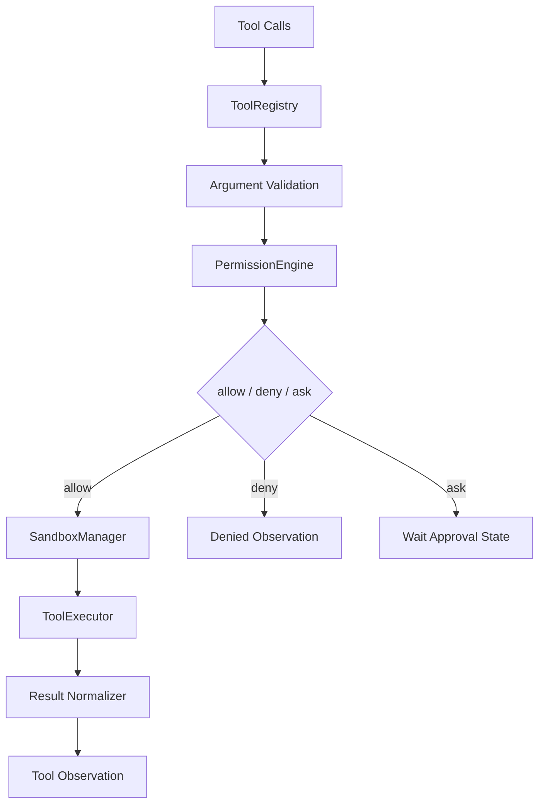

# 03. ToolRuntime、权限与 Sandbox

本文件定义工具执行层的完整设计。

这部分必须独立成 `ToolRuntime`，否则工具执行逻辑会散落在 loop、tool 实现、权限判断和 sandbox provider 中，后面会很难维护。

## 1. 这一层解决的问题

这一层专门解决：

- tool 如何注册
- tool 参数如何校验
- tool 执行前如何判断权限
- tool 在什么 sandbox 中执行
- tool 执行结果如何标准化
- tool 被拒绝、失败、超时后如何反馈给 agent

它不解决：

- 模型如何决定要不要调用工具
- 任务何时结束
- 记忆何时写入

## 2. 为什么必须做 ToolRuntime

如果没有独立 ToolRuntime，通常会出现这些问题：

1. 每个工具自己做权限校验，规则不统一
2. 每个工具自己决定要不要 sandbox，边界不一致
3. 工具结果格式混乱，模型下一轮很难稳定使用
4. 审计日志无法统一记录
5. “需要人工审批”的流程没有统一的挂起点

ToolRuntime 存在的意义就是把这些问题统一收口。

## 3. ToolRuntime 的内部结构

建议内部拆成 4 个模块：

- `ToolRegistry`
- `PermissionEngine`
- `SandboxManager`
- `ToolExecutor`

## 4. ToolRegistry 需要实现什么

ToolRegistry 不是一个“名字到函数”的简单 map，而是整个工具系统的注册中心。

### 4.1 ToolRegistry 必须承担的职责

- 注册工具定义
- 查询工具定义
- 按当前 agent / run 过滤可用工具
- 返回模型可见的 tool schema
- 返回 runtime 可执行的 tool handler

### 4.2 每个 tool definition 必须包含什么

至少包含：

- `name`
- `description`
- `inputSchema`
- `outputSchema`
- `timeoutMs`
- `sandboxProfile`
- `permissionProfile`
- `idempotent`
- `retryPolicy`
- `executor`

这些字段的意义如下：

#### `name`

模型调用工具时使用的稳定标识。

#### `description`

给模型看的工具描述，帮助其决定何时调用。

#### `inputSchema`

工具输入参数的结构定义。运行时必须用它做校验。

#### `outputSchema`

用于规范工具输出的结构，避免 observation 质量过差。

#### `timeoutMs`

工具执行的最大时间，不应完全依赖 sandbox 的默认超时。

#### `sandboxProfile`

声明工具默认需要的 sandbox 能力，比如：

- `read_only`
- `workspace_write`
- `network_disabled`
- `network_allowlist`
- `trusted_local`

#### `permissionProfile`

声明工具默认风险和授权要求，比如：

- `safe_read`
- `workspace_write`
- `external_network`
- `destructive_action`

#### `idempotent`

告诉 runtime 这个工具是否可重复执行。

#### `retryPolicy`

允许工具声明自己的重试策略，但最终是否重试由 runtime 决定。

#### `executor`

真正的执行函数或执行器对象。

### 4.3 ToolRegistry 为什么不能只存一个函数

因为后续这几件事都依赖丰富元数据：

- 权限策略
- sandbox 选择
- 超时控制
- observation 格式化
- 自动审计

如果注册中心只存一个函数，后面 runtime 层会非常被动。

## 5. PermissionEngine 需要实现什么

PermissionEngine 用来回答一个问题：

“这个 tool invocation 现在能不能执行？”

### 5.1 它必须是独立层的原因

权限判断不是工具本身的业务逻辑。

例如：

- 读取某个目录是否允许
- shell 命令是否允许
- 网络请求是否允许
- 某条命令是否需要人工确认

这些都应该由统一权限层判断，而不是散落在工具内部。

### 5.2 PermissionEngine 的输入

建议至少包括：

- `run`
- `step`
- `toolInvocation`
- `resolvedToolDefinition`
- `sessionPolicy`
- `userPolicy`
- `sandboxProfile`

### 5.3 PermissionEngine 的输出

必须返回结构化决策，而不是只返回布尔值。

推荐输出字段：

- `decision`
  - `allow`
  - `deny`
  - `ask`
- `reason`
- `riskLevel`
- `approvalMessage`
- `approvalPayload`
- `expiresAt`

### 5.4 为什么要三态而不是二态

因为 agent 场景里不仅有“允许”和“拒绝”，还有：

- 这件事危险，但用户确认后可以做

这就是 `ask` 状态，它是 agent runtime 的关键能力，不应被省略。

### 5.5 PermissionEngine 的实现步骤

建议顺序：

1. 读取全局默认策略
2. 读取当前会话策略
3. 读取 tool 自带权限级别
4. 分析参数是否扩大风险
5. 输出最终授权决策

例如：

- `read_file` 读 workspace 内文件可以自动允许
- `shell_command` 执行只读命令可能自动允许
- `shell_command` 执行 `rm -rf` 则直接拒绝
- `http_request` 请求外网时可能需要 ask

## 6. SandboxManager 需要实现什么

SandboxManager 回答的是另一个问题：

“允许执行之后，在哪个受控环境里执行？”

### 6.1 权限和 sandbox 的区别

这是设计里最容易混淆的一点。

- 权限：能不能做
- sandbox：允许之后，在什么边界里做

一个 tool invocation 可能：

- 权限允许，但只能在只读 sandbox 里执行
- 权限允许，但必须限制网络
- 权限允许，但只能写特定目录

### 6.2 SandboxManager 的职责

- 根据 tool 和 session 选择 sandbox profile
- 创建或复用 sandbox session
- 注入受控环境变量
- 控制网络能力
- 控制文件系统边界
- 控制命令执行能力
- 返回统一 sandbox handle

### 6.3 建议的一期 sandbox profile

先从这几种固定 profile 开始：

- `read_only`
  - 允许读取文件
  - 禁止写文件
  - 禁止网络
  - 禁止危险命令

- `workspace_write`
  - 允许读写 workspace
  - 禁止访问外部敏感路径

- `network_disabled`
  - 完全禁网

- `network_allowlist`
  - 仅允许访问指定域名列表

- `trusted_local`
  - 高权限执行
  - 只适合受信工具

### 6.4 SandboxManager 不应该做什么

不应该：

- 判断业务上是否允许该操作
- 直接决定最终是否 ask user
- 直接将 observation 写回模型上下文

这些都属于权限或 Harness。

## 7. ToolExecutor 需要实现什么

ToolExecutor 是真正“执行工具”的地方。

### 7.1 它的输入

- `ToolInvocation`
- `ToolDefinition`
- `ValidatedArgs`
- `SandboxHandle`
- `AbortSignal`
- `ExecutionContext`

### 7.2 它必须做的事情

1. 再次确认参数已经通过 schema 校验
2. 设置 timeout / abort
3. 调用实际执行器
4. 捕获异常
5. 记录耗时
6. 将原始结果标准化为 `ToolExecutionResult`

### 7.3 ToolExecutor 不应该做的事情

不应该：

- 决定是否允许执行
- 决定在哪个 sandbox 里执行
- 决定最终任务是否结束

### 7.4 为什么 ToolExecutor 要单独存在

如果没有这一层，后面会出现：

- 一些工具自己有 timeout
- 一些工具自己没有 timeout
- 一些工具直接返回字符串
- 一些工具返回对象
- 错误捕获方式不一致

这会让 observation 和审计完全不稳定。

## 8. ToolInvocation 的实现要求

ToolInvocation 必须是结构化对象，而不是只传 `(name, args)`。

### 8.1 必须包含的字段

- `toolCallId`
- `toolName`
- `args`
- `requestedByRunId`
- `requestedByStep`
- `sandboxProfile`
- `permissionProfile`
- `timeoutMs`
- `retryable`
- `idempotent`

### 8.2 为什么要有这些字段

因为后续你要支持：

- 审批恢复
- trace
- 重试
- 去重
- replay

没有这些字段，后续扩展会很困难。

## 9. ToolExecutionResult 的实现要求

结果对象也必须结构化。

### 9.1 必须包含的字段

- `toolCallId`
- `success`
- `outputText`
- `structuredData`
- `artifacts`
- `error`
- `durationMs`
- `exitCode`
- `truncated`
- `metadata`

### 9.2 为什么不能只返回字符串

因为后续下面这些处理都依赖结构化：

- memory candidate 提取
- observation 压缩
- 错误分类
- artifact 索引
- 前端展示

## 10. Tool observation 如何生成

工具结果不能原样塞回上下文，必须生成 observation。

### 10.1 observation 至少要包含

- 使用了哪个工具
- 参数摘要
- 是否成功
- 结果摘要
- 错误摘要
- artifact 引用

### 10.2 生成 observation 的原因

如果把原始结果直接塞回模型：

- 日志太长
- 噪音太多
- prompt injection 风险变高
- 后续 summary 很难压缩

因此 runtime 必须统一把结果加工成 observation。

## 11. 审批等待流程

这一部分是权限系统必须和状态机打通的地方。

### 11.1 流程步骤

1. 模型决定调用 tool
2. ToolRuntime 调用 PermissionEngine
3. PermissionEngine 返回 `ask`
4. Harness 将 run 状态切到 `waiting_permission`
5. 保存 pending invocation
6. 等用户批准或拒绝
7. 用户批准后恢复执行
8. 用户拒绝后生成 denial observation

### 11.2 为什么必须保存 pending invocation

因为批准往往不是实时同步的。

如果不保存：

- 恢复时不知道刚才要执行什么
- 无法在 UI 中展示“待批准操作”
- 无法保证恢复时执行的是同一调用

## 12. 错误分类

建议将工具层错误拆成以下几类：

- `ToolValidationError`
  - 参数校验失败

- `PermissionDeniedError`
  - 权限策略明确拒绝

- `ApprovalRequiredError`
  - 需要人工确认

- `SandboxExecutionError`
  - sandbox 创建或执行失败

- `ToolExecutionError`
  - 业务逻辑执行失败

- `ToolTimeoutError`
  - 超时

### 12.1 为什么要明确分类

因为不同错误后续处理不同：

- `PermissionDeniedError` 应转 observation
- `ApprovalRequiredError` 应切换状态
- `ToolTimeoutError` 可能允许重试
- `ToolExecutionError` 可能只需反馈给模型继续思考

## 13. 一期建议的实现顺序

### 第一步：先做 ToolRegistry

目标：

- 能注册工具
- 能返回模型可见 schema
- 能返回执行器

### 第二步：做 ToolExecutor

目标：

- 能统一执行工具
- 能超时和捕错
- 能返回 `ToolExecutionResult`

### 第三步：做 PermissionEngine

目标：

- 至少支持 `allow / deny / ask`

### 第四步：做 SandboxManager

目标：

- 至少支持几个固定 profile
- 能给工具返回统一受控执行环境

### 第五步：整合为 ToolRuntime

目标：

- 输入 `ToolInvocation[]`
- 输出 observation 或 waiting state

## 14. 本文件结论

ToolRuntime 必须是独立的工具事务层，其内部至少要清晰拆成：

- `ToolRegistry`
- `PermissionEngine`
- `SandboxManager`
- `ToolExecutor`

只有这样，你后面做权限确认、沙箱、审计、结果压缩、恢复执行时，核心控制流才会稳定。

