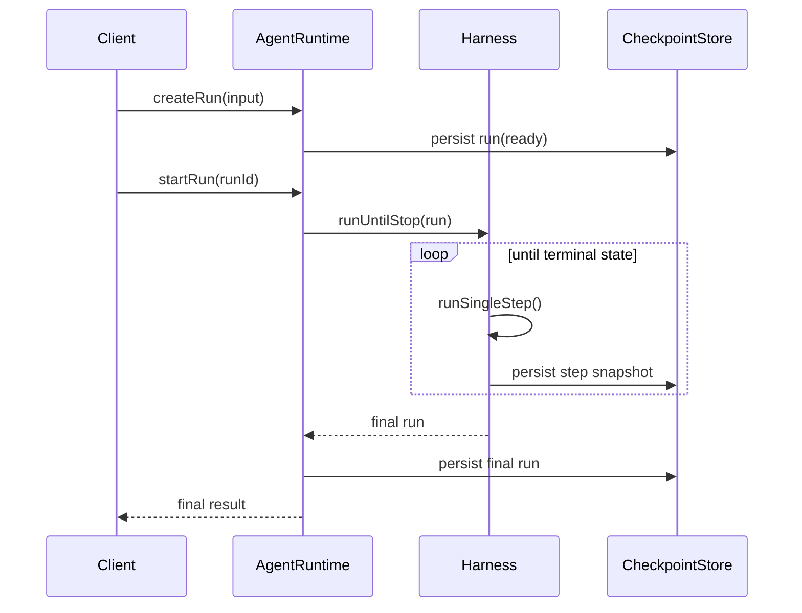

# 08. Runtime 时序与状态契约

本文件专门定义“运行时各阶段必须遵守的顺序和契约”。

如果没有这份契约，后续即使模块都存在，也很容易出现以下问题：

- 某些步骤先后顺序颠倒
- summary 更新时机不一致
- tool observation 写回太早或太晚
- termination 在错误时机触发

## 1. 为什么要单独定义时序契约

因为 agent runtime 不是一组孤立模块，而是一条严格有先后顺序的执行链。

例如：

- memory 检索必须发生在模型调用前
- observation 生成必须发生在工具执行后
- termination 检查必须发生在 step 收尾阶段

如果这些顺序不稳定，系统行为会变得非常难预测。

## 2. 一次完整 run 的顶层时序



## 3. 单轮 step 的标准时序

这应该是实现时最严格遵守的一条时序。

```mermaid
sequenceDiagram
    participant Harness
    participant Hooks
    participant Context
    participant Memory
    participant Loop as ReActLoopEngine
    participant Tool as ToolRuntime
    participant Term as TerminationPolicy

    Harness->>Hooks: beforeStep
    Harness->>Context: buildStepContext
    Context->>Memory: retrieveRelevantMemories
    Context-->>Harness: StepContext
    Harness->>Memory: compressContextIfNeeded
    Harness->>Loop: executeStep(context)
    Loop-->>Harness: AgentDecision
    Harness->>Hooks: afterModelCall
    alt tool_calls
      Harness->>Tool: execute()
      Tool-->>Harness: ToolRuntimeResult
    else final_answer
      Harness->>Harness: handleFinalAnswer
    else ask_user
      Harness->>Harness: waiting_input
    end
    Harness->>Memory: extractCandidates
    Harness->>Memory: updateSummary
    Harness->>Term: evaluate
    Harness->>Hooks: afterStep
```

## 4. 单轮 step 必须遵守的阶段划分

建议明确划分成下面 7 个阶段，每个阶段做的事情固定。

### 阶段 1：Step Prepare

职责：

- 确认 run 当前允许推进
- 检查 budget
- 构造空的 `StepState`
- 触发 `beforeStep`

禁止：

- 在这一阶段直接调用模型

### 阶段 2：Context Build

职责：

- 收集 recent history
- 收集 summary
- 检索 relevant memory
- 注入 available tools
- 注入 constraints

禁止：

- 在这一阶段直接写长期 memory

### 阶段 3：Context Normalize / Compress

职责：

- 检查 token / step 阈值
- 压缩旧消息
- 压缩旧工具结果
- 必要时更新临时 summary 版本

禁止：

- 在这里改变 run 终止状态

### 阶段 4：Model Step

职责：

- 构造模型请求
- 调用 `ModelGateway`
- 应用 `ModelCompatibilityStrategy`
- 解析成 `AgentDecision`

禁止：

- 直接执行工具

### 阶段 5：Decision Dispatch

职责：

- 按决策类型分发
- 进入 tool / final / ask_user / blocked 路径

禁止：

- 在 `dispatch` 之外绕过路由直接调用 tool runtime

### 阶段 6：Step Aftermath

职责：

- 生成 observation
- 提取 memory candidate
- 更新 summary

禁止：

- 忽略 observation 就直接进入下一轮

### 阶段 7：Termination Check

职责：

- 运行终止策略
- 决定下一状态

禁止：

- 在这之前先把 run 标为 finished

## 5. 状态切换契约

每次状态切换都应该满足前置条件和后置条件。

### 5.1 `ready -> running`

前置条件：

- run 已创建
- 无 pending approval
- 无 pending input

后置条件：

- `startedAt` 已设置
- 可以进入第一轮 step

### 5.2 `running -> waiting_permission`

前置条件：

- 当前 step 有待执行的 tool invocation
- PermissionEngine 返回 `ask`

后置条件：

- `pendingApproval` 必须落库
- 当前 step 必须可恢复

### 5.3 `running -> waiting_input`

前置条件：

- 决策为 `ask_user`
- 当前 step 无法继续推进

后置条件：

- `pendingUserInput` 已保存
- run 可在补充输入后恢复

### 5.4 `running -> finished`

前置条件：

- TerminationPolicy 返回 `finish`

后置条件：

- `finalResult` 已保存
- `finishedAt` 已设置

### 5.5 `running -> failed`

前置条件：

- 出现不可恢复错误

后置条件：

- `error` 已保存
- 当前状态不可再继续推进 step

## 6. 数据流契约

### 6.1 ContextBuilder 的输出只能作为模型输入源

`StepContext` 应该是模型调用前的唯一统一上下文对象。

不要让：

- hook 自己直接拼模型请求
- tool runtime 自己往 messages 塞内容
- termination policy 自己往上下文里插内容

### 6.2 ToolRuntime 的输出不能直接作为下一轮 raw message

工具结果必须先标准化成 observation，再决定如何进入上下文。

### 6.3 Memory 写入和 Memory 检索必须分时机

- 检索：模型调用前
- 写入：step 收尾阶段

### 6.4 Summary 更新不能完全替代 raw trace

summary 只是压缩结果，不是唯一真实历史。

必须始终保留：

- 原始消息或其外部存档
- 原始 tool results 或其引用
- step trace

## 7. 错误传播契约

不同阶段出现错误时，处理方式不应混乱。

### 7.1 Context Build 阶段错误

原则：

- 如果是可恢复的读取错误，可降级继续
- 如果上下文无法构建，则当前 step 失败

### 7.2 Model Step 阶段错误

原则：

- 交由模型层重试或兼容策略处理
- 最终仍失败时，返回结构化模型错误

### 7.3 Tool Runtime 阶段错误

原则：

- 尽可能标准化成 tool failure observation
- 只有不可恢复时才上升为 run failure

### 7.4 Memory 持久化错误

原则：

- 不应默认导致整个 run 失败
- 应记录事件并根据策略决定是否降级

### 7.5 Termination 阶段错误

原则：

- termination 自身异常应视为系统错误
- 因为这意味着 runtime 已经失去对结束状态的判断能力

## 8. Checkpoint 契约

建议至少在下面几个点做 checkpoint：

### 8.1 Run created

保存初始 run。

### 8.2 Step started

保存初始 StepState。

### 8.3 Decision parsed

保存本轮决策，便于恢复。

### 8.4 Pending approval created

保存待批准调用。

### 8.5 Tool execution completed

保存工具执行结果与 observation。

### 8.6 Step finished

保存完整 StepState。

### 8.7 Run finished / failed

保存最终 run。

## 9. 恢复契约

恢复能力必须明确区分来源状态。

### 9.1 从 `paused` 恢复

要求：

- 直接从下一个合法 step 继续

### 9.2 从 `waiting_permission` 恢复

要求：

- 使用已保存的 `pendingApproval`
- 不重新生成新的 tool invocation

### 9.3 从 `waiting_input` 恢复

要求：

- 将用户新输入以显式消息或结构化输入注入 run
- 然后回到 `running`

## 10. 关键实现约束清单

以下约束建议作为代码评审检查项：

1. 模型调用前必须已经构建好完整 StepContext
2. 工具结果必须先转 observation，再进入后续上下文
3. memory 检索在前，memory 持久化在后
4. termination 必须在 step 收尾阶段统一执行
5. 状态切换必须经过状态机，不允许随意直接赋值
6. `waiting_permission` 必须保存完整待恢复信息
7. `final_answer` 不等于一定 finished，必须先过 termination

## 11. 本文件结论

实现时，最重要的不是每个模块单独看起来合理，而是它们在运行时必须按稳定顺序协作。

这份文档定义的就是那条顺序和契约：

- step 从哪里开始
- 中间每个阶段做什么
- 哪些状态如何进入和恢复
- 哪些数据在什么阶段读写

后续只要实现遵守这份契约，agent runtime 的整体行为就会稳定很多。

