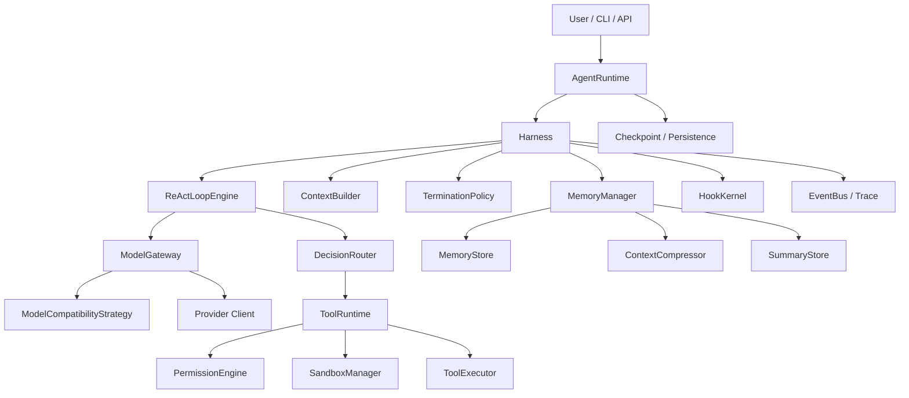

# Agent Runtime 技术架构设计

本文档集定义 `@renx/agent` 的目标架构、模块边界、运行时职责、实现步骤与一期落地顺序。

这组文档的目标不是介绍概念，而是给实现者一份可以直接据此拆模块、定接口、开始编码的设计说明。

## 1. 适用范围

本文档覆盖的能力包括：

- 循环执行任务
- ReAct 风格任务推进
- tool 调用与标准化 observation
- tool sandbox 执行
- tool 权限确认
- hook / middleware 插件扩展
- Harness 编排层
- 上下文压缩
- 长短期记忆与动态记忆写入
- 结束判定
- 后续 subagent / harness agent 扩展能力

本文档不覆盖：

- 具体 TypeScript 代码实现
- 具体 UI 展示方案
- 具体数据库 schema
- 具体 sandbox provider 的底层实现细节

## 2. 当前仓库现状

当前仓库已经有较完整的 `provider` 层，但 `agent` 层仍然处于雏形状态。

- `packages/provider`
  - 已具备模型统一调用、tool calling、streaming、hooks、retry 等基础能力
  - 这是未来 `ModelGateway` 的底座
- `packages/agent`
  - 当前只有一个很薄的 run loop 雏形
  - 尚未形成完整的 runtime / harness / tool / memory / policy 架构

因此，本设计的基本原则是：

1. `provider` 继续只负责模型调用，不重做 LLM SDK。
2. 新的 `agent` 层负责“如何执行任务”，而不是“如何与模型厂商协议交互”。
3. agent runtime 必须显式存在，不能只靠零散 hook 实现主流程。

## 3. 文档导航

- [01-current-state-and-target.md](./01-current-state-and-target.md)
  - 当前问题、目标分层、目标模块图、设计原则
- [02-runtime-harness-react-loop.md](./02-runtime-harness-react-loop.md)
  - AgentRuntime、Harness、ReActLoop、状态机、单轮 step 细节
- [03-tool-permission-sandbox.md](./03-tool-permission-sandbox.md)
  - ToolRuntime、权限、sandbox、执行事务、错误分类
- [04-context-memory-termination.md](./04-context-memory-termination.md)
  - 上下文构建、压缩、记忆系统、结束判定
- [05-hooks-model-compatibility-and-plugins.md](./05-hooks-model-compatibility-and-plugins.md)
  - hook / middleware、模型兼容策略、插件边界
- [06-implementation-roadmap.md](./06-implementation-roadmap.md)
  - 一期到三期的推荐落地顺序、每期应完成的模块与验收点
- [07-core-types-and-interface-drafts.md](./07-core-types-and-interface-drafts.md)
  - 核心对象、模块接口草案、字段与方法建议
- [08-runtime-sequence-and-state-contracts.md](./08-runtime-sequence-and-state-contracts.md)
  - 单轮时序、状态迁移、checkpoint 与恢复契约
- [09-recommended-file-structure-and-implementation-checklist.md](./09-recommended-file-structure-and-implementation-checklist.md)
  - 推荐文件结构、按文件职责说明、实现清单

## 4. 顶层架构图

## 5. 先读什么

如果你是“先做一期最小可运行版本”，建议阅读顺序如下：

1. `01-current-state-and-target.md`
2. `02-runtime-harness-react-loop.md`
3. `03-tool-permission-sandbox.md`
4. `06-implementation-roadmap.md`
5. `07-core-types-and-interface-drafts.md`
6. `09-recommended-file-structure-and-implementation-checklist.md`

如果你要先把记忆和上下文治理做完整，再阅读：

1. `04-context-memory-termination.md`
2. `05-hooks-model-compatibility-and-plugins.md`
3. `08-runtime-sequence-and-state-contracts.md`

## 6. 设计原则

在实现过程中，必须坚持下面这些原则：

### 6.1 主流程显式

主循环必须由显式的 `Harness` 和 `ReActLoopEngine` 管理，不能把控制流散落在 hook 中。

### 6.2 差异分层

不同层解决不同问题：

- `provider / adapter`：协议差异
- `model strategy`：模型行为差异
- `runtime / harness`：任务编排
- `tool runtime`：工具事务
- `memory`：长期信息与上下文治理

### 6.3 扩展与主控分离

hook / middleware / plugin 只做扩展，不直接接管主状态机。

### 6.4 工具调用是事务

一次 tool call 必须被视为完整事务：

1. 决策产生
2. 参数验证
3. 权限判断
4. sandbox 选择
5. 执行
6. 结果标准化
7. 写 observation

### 6.5 结束判定由运行时复核

不能只因为模型说“完成了”就结束。runtime 必须通过 `TerminationPolicy` 二次判断。

### 6.6 记忆必须受控写入

不能把任何 observation 都直接写入 memory。必须经过提取、评分、去重、合并、落库流水线。

## 7. 本文档的使用方式

推荐使用方式：

1. 先按本文档划分目录与模块。
2. 再为每个模块定义接口和测试目标。
3. 按 `06-implementation-roadmap.md` 的阶段顺序逐步实现。
4. 每完成一阶段，用文档中的“验收点”检查是否真正达成。

本文档集可以作为：

- 实现规格
- 代码评审基线
- 后续重构时的边界说明
